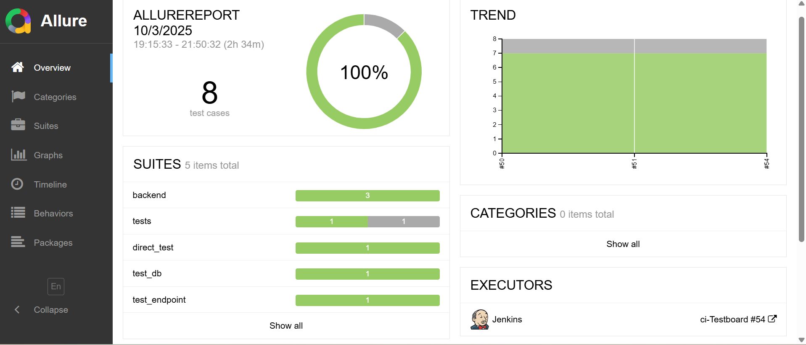

# TestBoard – QA Management & CI/CD Automation Platform



> 🚀 A modern QA Management System with full CI/CD automation using **FastAPI**, **PostgreSQL**, **Pytest**, **Allure**, and **Jenkins**.

---

##  Overview

**TestBoard** is a full-stack QA management platform built for test engineers to **create**, **run**, and **track** test cases, test runs, and results — with complete automation through **Jenkins pipelines** and visual **Allure reports**.

The platform is designed to simulate real-world QA workflows, integrating backend, database, CI/CD, and reporting layers into one continuous testing ecosystem.

---

##  Tech Stack

| Layer | Technologies |
|-------|---------------|
| **Backend** | FastAPI · SQLAlchemy · Alembic · PostgreSQL |
| **Frontend** | React (TypeScript) *(under development)* |
| **Testing** | Pytest · Allure · Postman |
| **CI/CD** | Jenkins · Docker · GitHub Actions |
| **Environment** | Virtualenv · Docker Compose |
| **Language** | Python 3.13 |

---

##  Jenkins CI/CD Pipeline

The **Jenkins pipeline** automatically performs:

1. **Checkout** repository from GitHub  
2.  **Create and activate venv**  
3.  **Install dependencies** via `requirements.txt`  
4.  **Run database migrations** using Alembic  
5.  **Start FastAPI server** on port `8001`  
6.  **Execute tests** via Pytest  
7.  **Generate Allure reports**  
8.  **Authenticate and push results** to TestBoard’s backend  
9.  **Clean up containers and processes**  

 All steps are timestamped and logged in Jenkins, with test results published automatically to the **Allure dashboard**.

---

## Allure Report Example


The screenshot above shows the **Allure report** generated automatically after a Jenkins pipeline run.  
All tests passed successfully, including API and database validations.

---

##  How to Run Locally

### Backend Setup

```bash
# Clone the repo
git clone https://github.com/salwa2106/Testboard2.git
cd Testboard2/backend

# Create virtual environment
python -m venv .venv
.venv\Scripts\activate  # on Windows

# Install dependencies
pip install -r requirements.txt

# Run the app
uvicorn app.main:app --reload --port 8001

Then open the API docs at:
http://127.0.0.1:8001/docs


##  CI/CD Integration with Jenkins

This project includes a full **Jenkinsfile** that automates the entire testing lifecycle:

1.Creates a virtual environment  
2.Installs dependencies  
3.Runs database migrations  
4.Starts the FastAPI server  
5.Executes tests with Pytest  
6.Generates and publishes Allure reports automatically  

---

## Example Test Run

Each Jenkins pipeline automatically:
1.Logs into the API to retrieve an access token  
2.Creates a CI run in TestBoard  
3.Executes all tests  
4. Uploads Allure results and publishes the report  

Everything from **login → run creation → testing → reporting** is fully automated within Jenkins 🚀  

---

##  Author

**Salwa Naoum**  
 B.Sc. Information Systems, University of Haifa  
 Focus: QA Automation · DevOps · CI/CD  
[LinkedIn Profile](https://www.linkedin.com/in/salwa-naoum-2305b2356)

